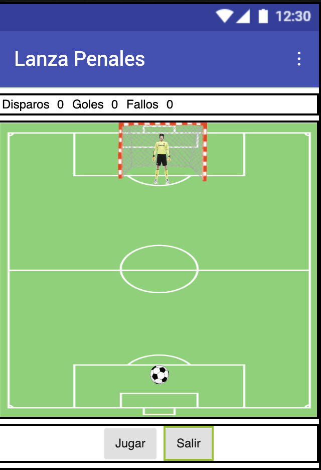
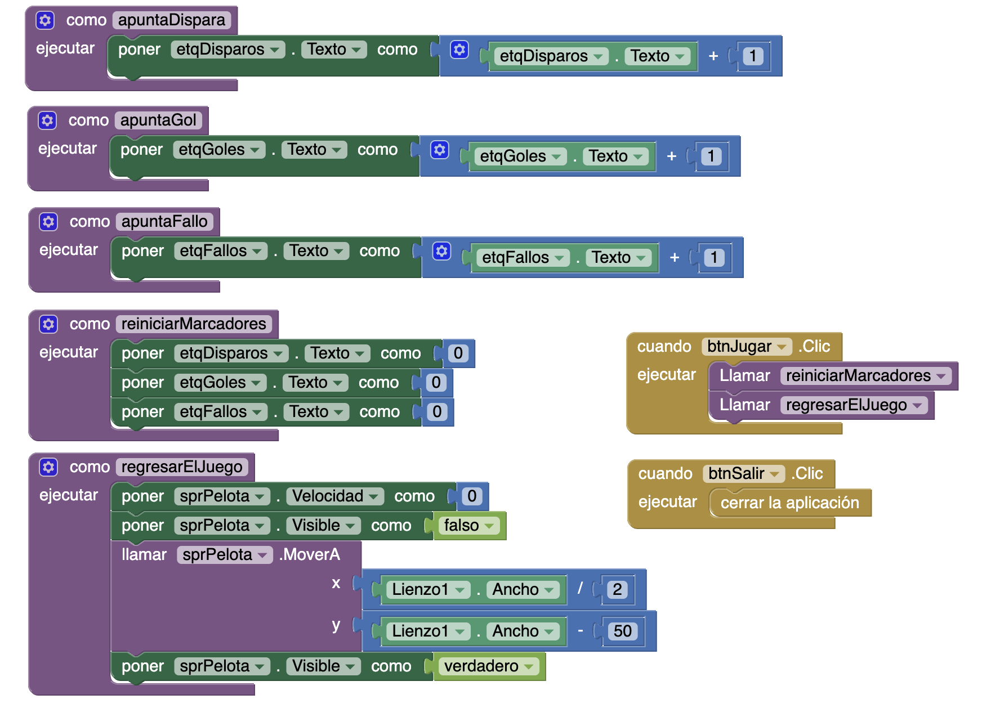
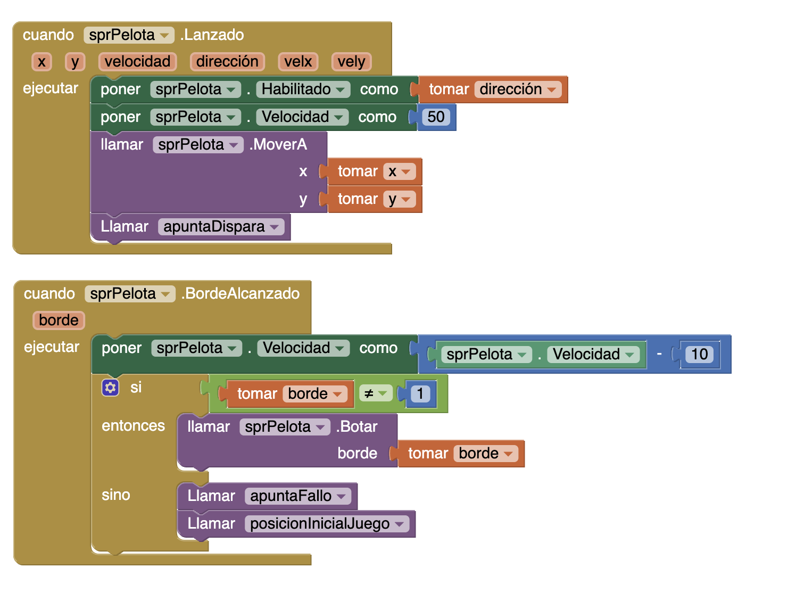
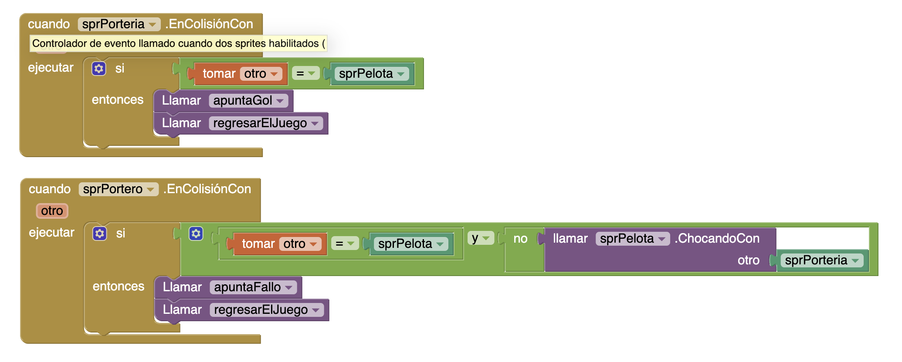
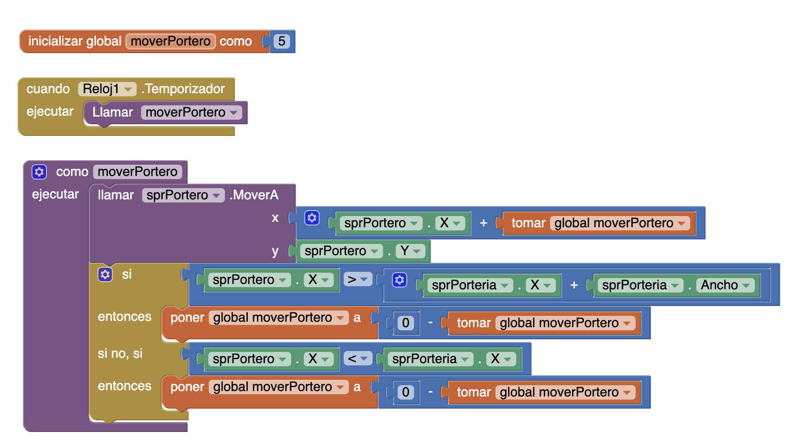
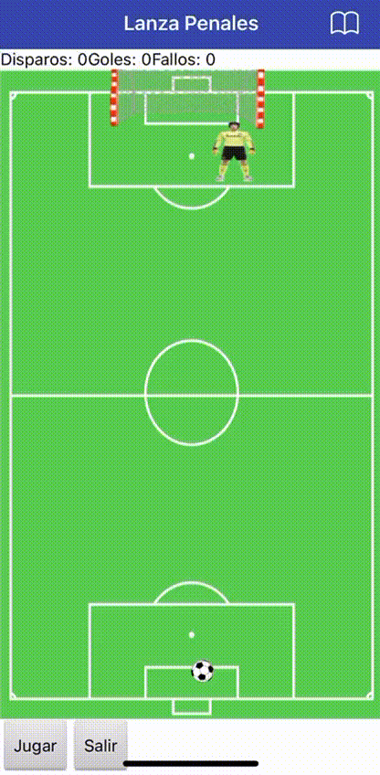

## Realiza lo siguiente

## Diseno
Descarga las imagenes: balon.png, campo.png, portero.png y porteria.png

Crea el siguiente diseno en la imagen:

1. Utiliza el componente lienzo ubicado en el menu dibujo y animacion. Y coloca el campo.png
2. Coloca 3 componentes porteria, portero y balon dentro del lienzo con la etiqueta spriteImagen. Ajustar el ancho y alto de cada una.
3. Cambiar los nombres para mejor identificacion y buena practica. Ejemplo: sprPorteria, sprtPortero y sprtBalon.
4. Anadir una disposiicon Tabular para la parte de los marcadores;
5. Utilza el componente etiqueta. Para nombrarlos, utiliza: etMarcador, etc. Cambia los nombres a como aparecen ahi.
6. En total son 6 etiquetas que necesitas.
7. En la parte de abajo poner una DispociionHorizontal, ajustar el ancho al tamano del contender y centrar los botones.
8. Colocar dos botones, y tambien cambiar el nombre: btnJugar, btnSalir, no confundir con el texto(tambien se debe ver como en la imagen).

## Bloques
Parte 1.
Hacer lo siguiente:

1. Anotar gol
2. Anotar fallo
3. Disparar
4. Reiniicar el marcador
5. Regresar al punto de partida(pelota)

Aplicando Procedimientos, 

Seleccionar la primera opcion y cambiar el nombre de procedimiento a apuntaDispara. 
En la parte de ejecutar, seleccionar el poner etqGoles.Texto como -> etqDisparos.Texto + 1
Dar clic izquierdo en el modulo que creamos y duplicar.

Cambiar a apuntaGol, etqGoles, etqGoles.Texto + 1
Cambiar a apuntaFallo, etqFallos, etqFallos.Texto + 1

Configurar los eventos clic, tenemos dos botones: 
btnJugar -> asignar los procedimientos creados: reiniciarMarcadores y regresarElJuego
btnSalir -> asignarle un control: salir del juego 

Parte 2. Lanzado y TocarBorde

Parte 3. Colisiones(2 o mas sprites se tocan)
Eg. El portero toca la porteria, el balon, etc.

Parte 4. Reloj y Movimiento

Regresar a la parte de diseno y colocar un reloj, que sera para que el portero se mueva.

Movimiento
Definir una variable global. (Definira la cantidad de pixeles que el portero va a avanzar).

Crear un procedimiento y asignarselo al Reloj1.Temporizador, ejecutar: procedimiento

Parte 5. Probar

Salida del programa

